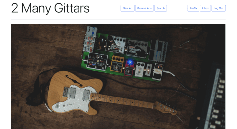
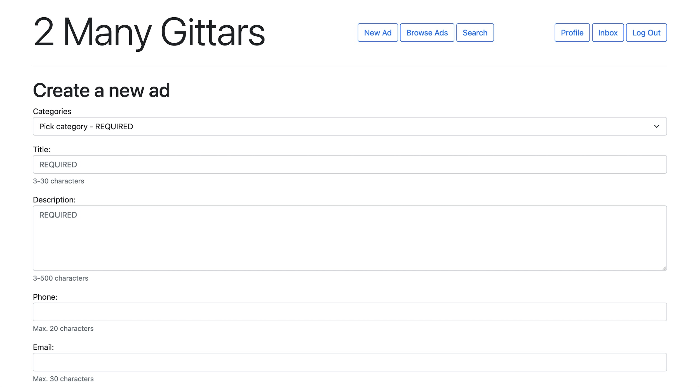
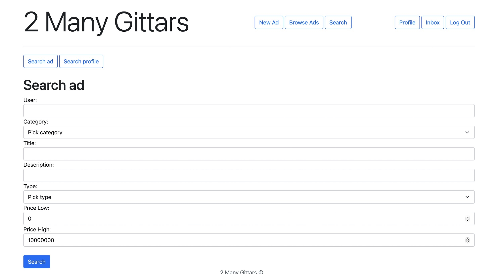
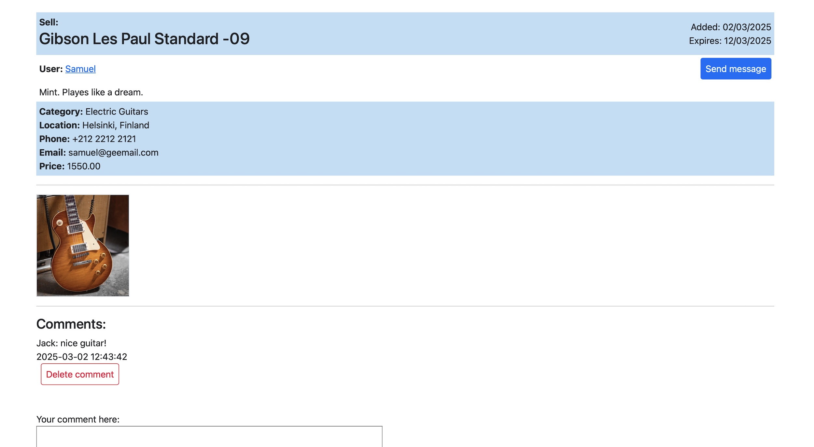
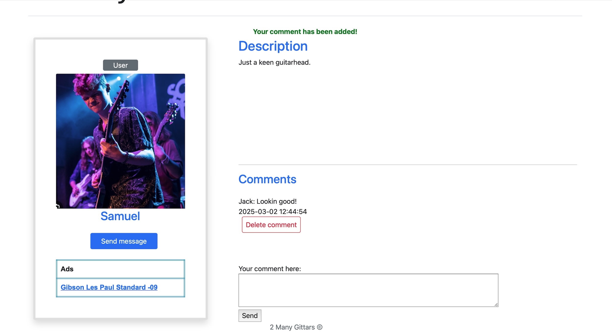
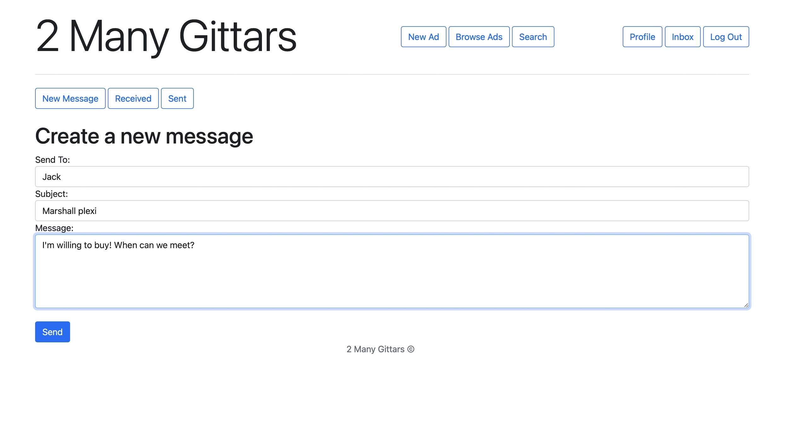
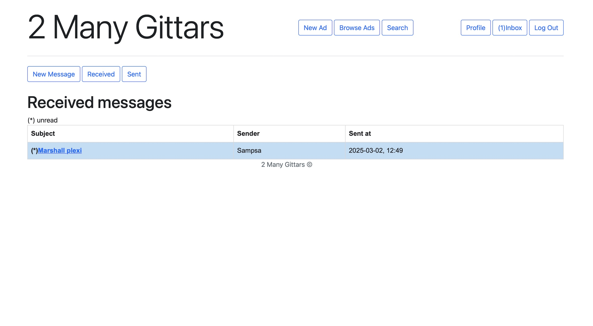
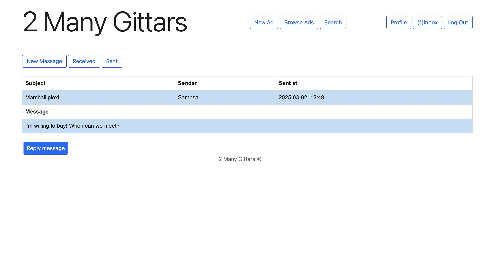

## 🛒 2 Many Gittars - Marketplace

 


A  **web-based marketplace application**  where users can create, browse, and manage advertisements. Users can post ads, upload images, send messages, and interact with others.

  

This project is deployed on  **Heroku**, check it out here:

🔗  [**Live Demo**](https://tsoha-2manygittars-332c1b1f9ef8.herokuapp.com/)

  

Built as part of a Helsinki university web development course, this project showcases  **full-stack development**  skills with a  **Python, Flask, PostgreSQL, and JavaScript**  stack.

### 🚀 Features

  

**✅ User Management**

•  **Register & Login:**  Secure authentication using hashed passwords and CSRF protection.

•  **Profiles:**  Users have personal pages where they can add descriptions and upload profile images.

•  **Admin Role:**  Admin users have additional rights, such as deleting other users’ content.

  

**📢 Ads**

•  **Post New Ads:**  Users can create ads with descriptions, categories, pricing, and expiration dates.

•  **Edit & Delete Ads:**  Users can update or remove their own ads.

•  **Image Upload:**  Ads can include images, which are stored in a PostgreSQL database.

•  **Search & Filter:**  Advanced search allows filtering by title, price range, categories, and keywords.

  

**✉️ Messaging System**

•  **Direct Messages:**  Users can send and receive private messages.

•  **Unread Notifications:**  The app tracks unread messages.

•  **Message History:**  Users can view their inbox and sent messages.

  

**💬 Comments & Reviews**

•  **Ad Comments:**  Users can leave comments on advertisements.

•  **Profile Reviews:**  Users can leave feedback on other users’ profiles.

•  **Admin Moderation:**  Admins can remove inappropriate comments.


### 🛠️ Technologies Used

| **Technology**       | **Purpose**                                         |
|----------------------|-----------------------------------------------------|
| 🐍 **Python**        | Backend logic and data handling                    |
| 🌎 **Flask**         | Web framework for routing and session management   |
| 🛢️ **PostgreSQL**    | Database for users, ads, messages, and images      |
| 🔗 **SQLAlchemy**    | ORM for database interactions                      |
| 🎨 **HTML, CSS, JS** | Frontend structure and styling                     |
| 🖋️ **Jinja2**        | Templating engine for rendering dynamic content    |
| 🔐 **Werkzeug Security** | Password hashing for authentication          |
| ☁️ **Heroku**        | Cloud hosting for deployment                       |

---

### 📸 Screenshots

<a href="./screenshots/1.jpg">
    
</a>
<a href="./screenshots/2.jpg">
    
</a>
<a href="./screenshots/3.jpg">
    
</a>
<a href="./screenshots/4.jpg">
    
</a>
<a href="./screenshots/5.jpg">
    
</a>
<a href="./screenshots/6.jpg">
    
</a>
<a href="./screenshots/7.jpg">
    
</a>
<a href="./screenshots/8.jpg">
    
</a>

---

  

### 🔧 Installation & Running Locally

  

**1️⃣ Clone the repository**

```
git clone https://github.com/sampsaoinonen/tsoha-martketplace.git
cd tsoha-martketplace
```

**2️⃣ Set up the virtual environment & install dependencies**

```
python -m venv venv
source venv/bin/activate  # On Windows use: venv\Scripts\activate
pip install -r requirements.txt
```

**3️⃣ Set up environment variables**

  

Create a  .env  file and define the following:

```
DATABASE_URL=your_postgres_database_url
SECRET_KEY=your_secret_key
```

**4️⃣ Initialize the database**

```
psql < schema.sql
```

**5️⃣ Run the application**

```
flask run
```

The app will be available at:  **http://127.0.0.1:5000/**

----


### 🎯 What did I learn from This Project?

  

This project demonstrates my ability to build a  **full-stack web application from scratch**, including:

•  Secure authentication & user management

•  Database design & SQL optimization

•  Backend development with Flask & PostgreSQL

•  Frontend templating with Jinja2

•  Deployment & hosting on Heroku

•  Applying best practices like **CSRF protection, password hashing, and form validation**
